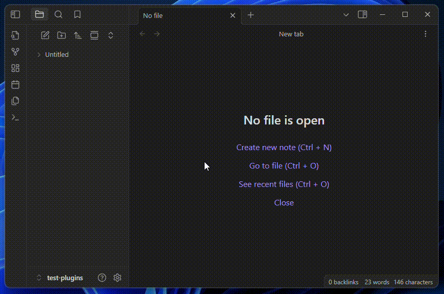

## What is it?



-   Reproduce an audio file
-   Tweak listening experience by changing: volume, playback speed, looping...
-   Add comments to desired timestamps
-   Quickly jump to a specific timestamp by left-clicking on the related comment
-   Modify/Delete a comment by right-clicking on it (dedicated button for mobile)
-   Inuitive keyboard shortcuts
-   Mobile compatible
-   Controllabe with obsdian commands

````
``` annotate-audio
#32a9143a94c3700d
source: [[My Audio.mp3]]
chunk: 00:00:00-00:02:52
volume: 0.5
speed: 1
loop: false
layout: 0
sticky: false
autoplay: false

37 --- Section 1
162 --- Section 2
174 --- Section 3
```
````

> The first line is the ID. You are free to personalize it (# + 16 characters hexadecimal) but dont move it around

### Options

Each audio-box has its owns. They can be tweaked manually or, more easily, **using the dedicated modal**.
(Their order is not important but they need to be placed before the comments)

| Name       | Default     | Values              | Description                                                                                     |
| ---------- | ----------- | ------------------- | ----------------------------------------------------------------------------------------------- |
| `source`   |             |                     | WikiLink to the audio file to reproduce                                                         |
| `volume`   | `0.5`       | `0.0` → `1.0`       | Player base volume                                                                              |
| `speed`    | `1`         | `0.0` → `1.0`       | Player playback speed                                                                           |
| `loop`     | `false`     | `true`/`false`      | Loop-back to beginning after getting to the end of the audio                                    |
| `sticky`   | `false`     | `true`/`false`      | Main controls become sticky, following you as you scroll down                                   |
| `layout`   | `0`         | `0,1,2`             | What player layout to display (feel free to make your own)                                      |
| `chunk`    | `undefined` | `HH:MM:SS-HH:MM:SS` | Section of audio to play                                                                        |
| `autoplay` | `false`     | `true`/`false`      | When clicking on a comment, the player starts playing from there instead of simply moving there |
|            |

There are also some options only available in specific `layout`s

| Layout | Name    | Default     | Values | Description                                                                                               |
| ------ | ------- | ----------- | ------ | --------------------------------------------------------------------------------------------------------- |
| 1      | `title` | `undefined` |        | Title of the player. If not present: not shown. If not set: name of audio file (or its alias, if present) |

### Obsidian Commands

| Name              | Action                                                 |
| ----------------- | ------------------------------------------------------ |
| `Add audiobox`    | Insert an already-configured audio-box inside the note |
| `Insert comment`  | Insert a comment in the last interacted audiobox       |
| `Pause audiobox`  | Pause player in the last interact audiobox             |
| `Play audiobox`   | Play player in the last interact audiobox              |
| `Toggle audiobox` | Toggle player in the last interact audiobox            |
| `Move forward`    | Move player forward in the last interact audiobox      |
| `Move backward`   | Move player backward in the last interact audiobox     |

---

## Development

### Road-Map

1. Add i18n support
2. Follow native folder exclusion in the audio file search
3. Render markdown even when modifying a comment (https://github.com/nothingislost/obsidian-cm6-attributes)

### Known Issues

-   Remove `editMode` flag as it's redundant
-   Better propagate the instruction to use cached values FROM "ParentApp" TO layouts
-   `title` option inside modal is not displayed correctly on mobile
-   Cache the total duration of the file
-   Resume player if it has been stopped after changing an option because of the re-render
-   Save new options only on unload

### Changelog

-   **1.4.0 (developing)**
    -   feat[#4](https://github.com/12-VidE/annotate-audio/issues/4): Each codeblock now has its own ID to better handle them
    -   feat[#6](https://github.com/12-VidE/annotate-audio/issues/6): New option `unstoppable`
    -   feat: new "Geek" `layout`
    -   fix[#6](https://github.com/12-VidE/annotate-audio/issues/6): Audio resumes after the comment is confirm
    -   fix: `chunk` is resetted correctly
-   **1.3.0**
    -   [#4](https://github.com/12-VidE/annotate-audio/issues/4) The plugin is now supported on mobile! (Not tested on iPhone)
    -   feat: Reset `chunk` option from the modal
    -   feat: More Obsidian commands
    -   fix [#5](https://github.com/12-VidE/annotate-audio/issues/5): Stop audiobox when another one start playing
    -   fix: Obsidian commands are shown only when they can be correctly applied
-   **1.2.1**
    -   fix: Read audio duration from metadata. It drastically decreases loading time
-   **1.2.0**
    -   feat: Select audio source on `Add audiobox` command using a modal
    -   feat: Add modal to manage player properties more easily
    -   feat: Options + Wavegraph cache handling
    -   feat: Render "404" block when `source` is invalid/absent
    -   fix: Removed alias as possible `title` option (useless)
-   **1.1.0**
    -   Allow each player to be independent by creating its refs in `ParentApp.vue` and passing them as `props`. To use targeted Obsidian commands, each player is called by its `id`
    -   feat [#1](https://github.com/12-VidE/annotate-audio/issues/1): Added Obsidian command `Insert comment`
    -   feat: [#3](https://github.com/12-VidE/annotate-audio/issues/3) Added `autoplay` option
    -   fix: Render `LayoutDefault` even when property `title` is not present
    -   fix: Player always strat from start of `chunk`
-   **1.0.0**
    -   Complete redesign, moving from Vue "Options API" to "Composition API". This will allow better flexibility in the future
    -   feat: Add ability to reproduce a `chunk` of the total audio
    -   feat: Allow to choose beetween different `layout`s
    -   fix [#2](https://github.com/12-VidE/annotate-audio/issues/2): Change `comment` style so it doesn't conflict with Obsidian native one
-   **0.1.1**
    -   fix: Renamed `Add Audio-Box` command to `Add audiobox` to follow "Plugin gidelines"
    -   feat: Show `source` alias as title if it exists and `title` option is `undefined`
-   **0.1.0 -** Initial release

---

## Credits

These are the sources on which I've initially developed this plugin:

-   **Original Repo:** ["obsidian-audio-player" by noonesimg](https://github.com/noonesimg/obsidian-audio-player)
-   **Other Fork:** ["obsidian-enhanced-audio-player" by Yidaotus](https://github.com/Yidaotus/obsidian-enhanced-audio-player)
-   **Other Fork:** ["obsidian-audio-player" by dtkav](https://github.com/dtkav/obsidian-audio-player)
