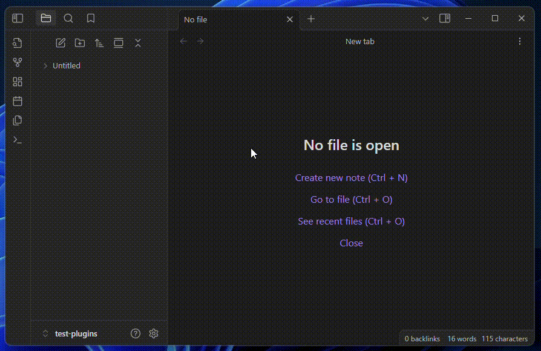

> [This is a (sort of) fork of "obsidian-audio-player" by noonesimg](https://github.com/noonesimg/obsidian-audio-player)

## What is it?



-   Reproduce an audio file
-   Tweak listening experience by changing: volume, playback speed, looping...
-   Add comments to desired timestamps
-   Quickly jump to a specific timestamp by left-clicking on the related comment
-   Modify/Delete a comment by right-clicking on it

````
``` annotate-audio
source: [[My Audio.mp3]]
volume: 0.5
speed: 1
loop: false
sticky: false
title:
small: false

37 --- Section 1
162 --- Section 2
174 --- Section 3
```
````

### Options

| Name     | Default     | Boundaries     | Description                                                                                              |
| -------- | ----------- | -------------- | -------------------------------------------------------------------------------------------------------- |
| `source` |             |                | WikiLink to the audio file to reproduce                                                                  |
| `volume` | `0.5`       | `0.0` → `1.0`  | Player base volume                                                                                       |
| `speed`  | `1`         | `0.0` → `1.0`  | Player playback speed                                                                                    |
| `loop`   | `false`     | `true`/`false` | Loop-back to beginning after getting to the end of the audio                                             |
| `sticky` | `false`     | `true`/`false` | Main controls become sticky, following you as you scroll                                                 |
| `title`  | `undefined` |                | Title of the player. IF not present: not shown. IF not set: name of audio file (or its alias if present) |
| `small`  | `false`     | `true`/`false` | Size of the audio-box                                                                                    |

### Obsidian Commands

| Name            | Action                                             |
| --------------- | -------------------------------------------------- |
| `Add Audio-Box` | Insert an already-configured audio-box in the note |

---

## Development

### Road-Map

1. Allow only a `chunk` of audio to be reproduced
2. Better implement `small` size template
3. (main.ts) Implement better Obsidian commands that can manipulate 1 single player @a time
4. (main.ts) Use a modal to set-up an audio-box WHEN created via Obsidian command
5. Use the alias in the title (if nothing is specified)
6. Render markdown even WHEN modifying a comment (https://github.com/nothingislost/obsidian-cm6-attributes)

### Known Issues

-   (App.vue) `getCommentsArray`, `getComment`, `getPlaybackSpeedSetting`, `getLoopSetting`, `getVolumeSetting`, `getStickySetting` should be `computed` to be more efficient
-   Remove `codeblockContent` by extracting the lines directly from the file
-   (App.vue) Remove `currentTime` CAUSE redundant: use `this.player.currenTime`
-   (App.vue) Remove `duration` CAUSE redundant: use `this.player.duration`
-   WHEN calling a function for one instance of `annotate-audio` iin a file with multiple instances, the function is triggered also for all the other instances
-   After some seconds, it crashes the Obsidian mobile app

### Changelog

-   **0.1.0 -** Initial release

---

## Credits

-   **Original Repo:** ["obsidian-audio-player" by noonesimg](https://github.com/noonesimg/obsidian-audio-player)
-   **Other Fork:** ["obsidian-enhanced-audio-player" by Yidaotus](https://github.com/Yidaotus/obsidian-enhanced-audio-player)
-   **Other Fork:** ["obsidian-audio-player" by dtkav](https://github.com/dtkav/obsidian-audio-player)
